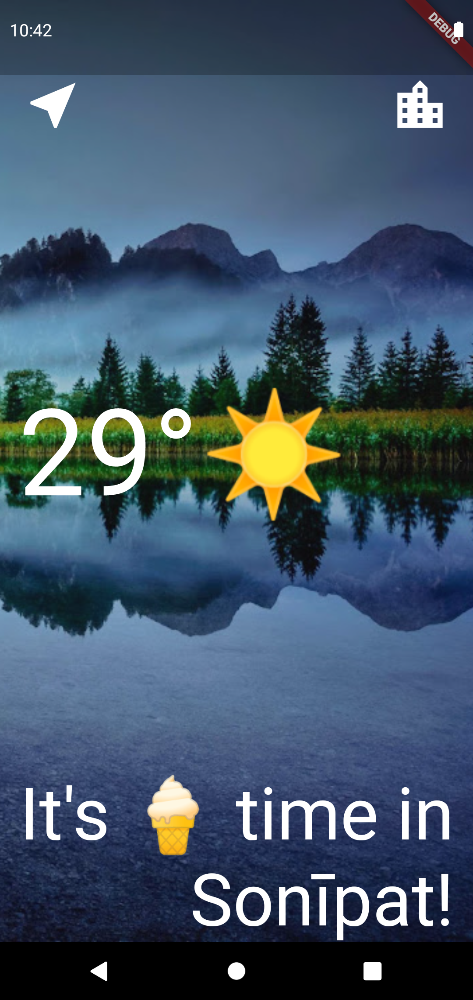
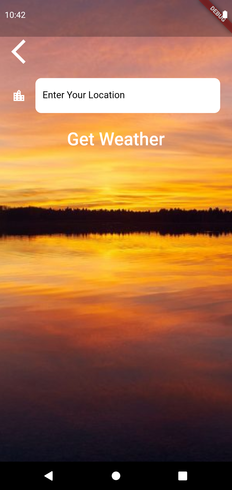
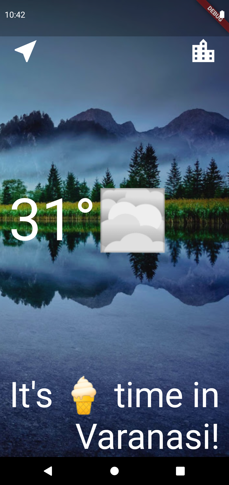
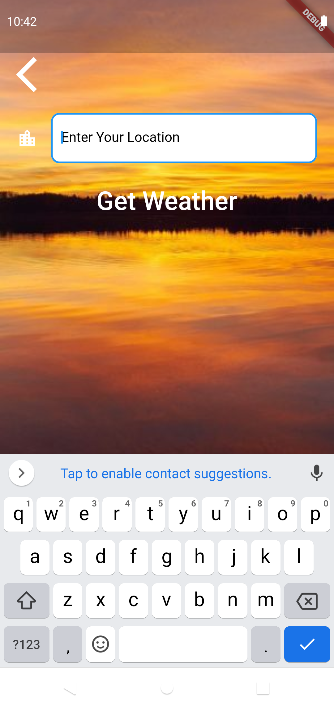
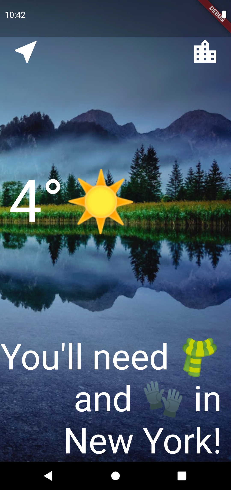
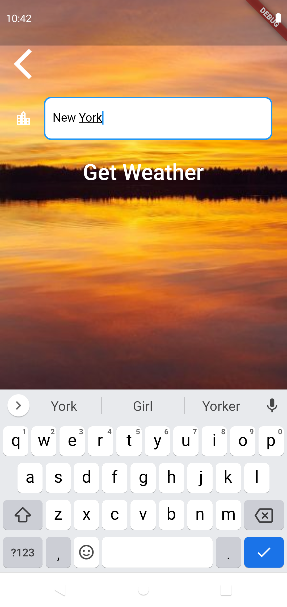
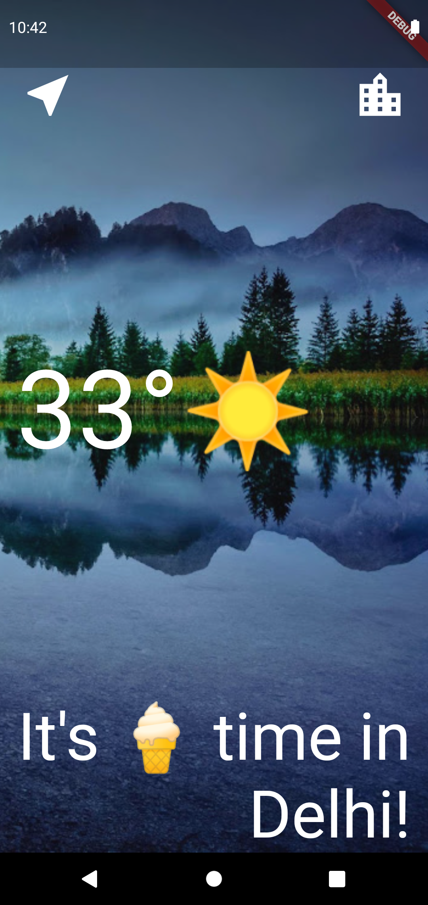

# Weather_Forecast_Application

Our Goal 🌟

The intention of developing weather app is to fetch the data in the need of taking information about weather worldwide. Another purpose for developing this software is to generate the report automatically at the end of the session or in the between of the session or in the between of the session as they require.

What We Have Created 👍

We’re going to make a weather app inspired by the beautiful designs made by SneekyPeeks. You'll be able to find out the live weather data in the current location of the device as well as the weather for any city you can think of!

Challenges 💡

      1-How to use Dart to perform asynchronous tasks.

      2-Understand async and await.

      3-Learn about Futures and how to work with them.

      4-How to network with the Dart http package.

      5-What APIs are and how to use them to get data from the internet.

      6-What JSONs are and how to parse them using the Dart convert package.

      7-How to pass data forwards and backwards between screens using the Navigator.

      8-How to handle exceptions in Dart using try/catch/throw.

      9-Learn about the lifecycle of Stateful Widgets and how to override them.

      10-How to use the Geolocator package to get live location data for both iOS and Android.

      11-How to use the TextField Widget to take user input.

IDE & Programming language 🔧

This Application was devlopped with Flutter using the Android Studio

Running The App 🔌

No requirements you just have to set your device and fill the information asked and click the Weather button then check your location weather 😃

Reference ☁️

https://openweathermap.org/

Screenshots 📱

        
